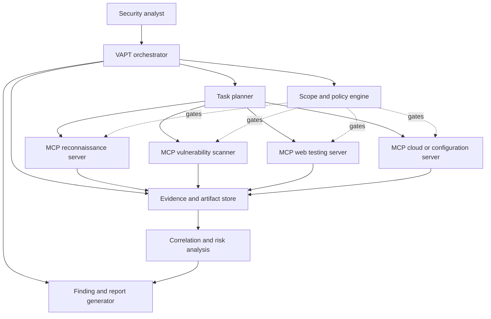

# VAPT Task Orchestration with MCP

This document describes a reference architecture for orchestrating a Vulnerability Assessment and Penetration Testing (VAPT) task with the Model Context Protocol (MCP).

The design separates planning, security tooling, evidence collection, analysis, and reporting. MCP is used as the contract between the orchestrator and capability servers; it does not replace authorization, network controls, or human approval.

## 1. Goals and Boundaries

The orchestration should:

- validate scope and authorization before any active testing;
- preserve a complete audit trail of decisions, commands, findings, and evidence;
- run discovery before intrusive testing and keep each phase independently resumable;
- require explicit approval for actions that may affect availability or data;
- produce reproducible findings with remediation-oriented evidence.

The workflow must remain inside the approved target scope. A target that is discovered during testing is not automatically authorized.

## 2. High-Level Architecture



### Main components

| Component | Responsibility |
| --- | --- |
| Analyst or ticketing system | Supplies the engagement request, authorization, scope, and approval decisions. |
| VAPT orchestrator | Maintains workflow state, schedules MCP calls, handles retries, and records audit events. |
| Policy engine | Enforces targets, exclusions, rate limits, allowed techniques, credentials, and approval gates. |
| MCP servers | Expose narrowly scoped tools and resources for reconnaissance, scanning, web testing, configuration review, or evidence retrieval. |
| Evidence store | Stores raw outputs, timestamps, target identifiers, hashes, screenshots, and tool metadata. |
| Analysis service | Deduplicates observations, validates evidence, assigns risk, and maps findings to standards such as CWE or CVSS. |
| Report generator | Produces an executive summary, technical findings, evidence references, and remediation guidance. |

## 3. End-to-End Workflow

### Phase 0: Intake and authorization

1. Create a unique engagement ID.
2. Record the requester, owner, authorization reference, time window, and emergency contact.
3. Normalize targets into IPs, hostnames, URLs, cloud resources, repositories, or applications.
4. Record explicit exclusions and forbidden actions.
5. Compile a policy object that every active tool call must receive.

No MCP tool should be able to start active testing without a valid engagement ID and policy decision.

### Phase 1: Planning

The planner converts the engagement into a dependency-aware task graph:

```text
authorize
  -> passive discovery
  -> target validation
  -> service and application enumeration
  -> vulnerability assessment
  -> approved validation or exploitation
  -> evidence review
  -> risk correlation
  -> report and handoff
```

Tasks should declare their required inputs, expected outputs, risk level, timeout, and approval requirement. Independent reconnaissance tasks can run in parallel, while validation and exploitation remain gated by policy.

### Phase 2: Discovery and enumeration

Use the least intrusive method that answers the question. Collect DNS, certificate, technology, service, endpoint, and configuration observations. Each observation should retain its source and confidence rather than being treated as a confirmed vulnerability.

### Phase 3: Assessment

The orchestrator sends normalized targets to the appropriate MCP server. Servers should return structured observations instead of only terminal text. The orchestrator stores the raw result, normalizes it, and links it to the task and target.

### Phase 4: Validation

Potentially impactful validation requires a separate approval decision. The policy engine should check the exact action, target, timing, expected impact, and rollback or stop procedure. A finding is not considered confirmed merely because a scanner reports it.

### Phase 5: Analysis and reporting

Correlate observations from multiple tools, remove duplicates, verify evidence, and assign severity based on business impact and exploitability. Reports should distinguish:

- observed facts;
- analyst interpretation;
- confidence level;
- assumptions and limitations;
- recommended remediation;
- retest criteria.

## 4. MCP Server Contract

Each server should expose small, purpose-specific tools. A conceptual tool request might look like:

```json
{
  "engagement_id": "eng-2026-001",
  "task_id": "task-enum-014",
  "target": "app.example.test",
  "scope": {
    "allowed_hosts": ["app.example.test"],
    "excluded_paths": ["/admin/delete"],
    "rate_limit_per_second": 2
  },
  "approval": {
    "required": false,
    "reference": "change-4821"
  },
  "parameters": {
    "depth": "standard"
  }
}
```

Results should include at least:

```json
{
  "status": "completed",
  "observations": [],
  "artifacts": [],
  "warnings": [],
  "started_at": "2026-09-07T10:00:00Z",
  "finished_at": "2026-09-07T10:04:12Z",
  "tool_version": "example-1.0.0"
}
```

The orchestrator must treat server output as untrusted input. Validate schemas, limit output sizes, sanitize report fields, and prevent tool output from changing policy or scope.

## 5. State and Failure Handling

Recommended task states are:

```text
PLANNED -> APPROVAL_REQUIRED -> READY -> RUNNING -> COMPLETED
                                      |        |
                                      |        +-> FAILED
                                      +-> BLOCKED
```

- Retry only transient failures, with bounded exponential backoff.
- Never retry an action that may have caused side effects without checking its result.
- Make tasks idempotent where possible by using task IDs and artifact hashes.
- Stop the engagement when scope validation fails, a safety control is unavailable, or an emergency stop is requested.
- Preserve partial evidence when a task fails; do not silently mark it as clean.

## 6. Security Controls

- Use least-privilege credentials per MCP server and engagement.
- Keep secrets in a secrets manager; do not place them in prompts, logs, or report artifacts.
- Enforce allowlists at the network boundary as well as in the orchestrator.
- Apply timeouts, concurrency limits, request-size limits, and output redaction.
- Log who approved each gated action and which exact policy version was used.
- Encrypt evidence in transit and at rest, with retention and deletion rules.
- Require human review before external delivery of the final report.

## 7. Minimal Orchestrator Loop

```text
load engagement
validate authorization and scope
create task graph
for each task whose dependencies are complete:
    evaluate policy
    if approval is required and missing:
        pause task
    else:
        call the selected MCP tool
        validate and store the result
        update task state and audit log
correlate observations
request analyst review
generate and deliver the approved report
```

The orchestrator owns authorization, sequencing, state, and auditability. MCP servers own their specialized tool integrations. Keeping those responsibilities separate makes the VAPT process easier to test, review, pause, and resume safely.
